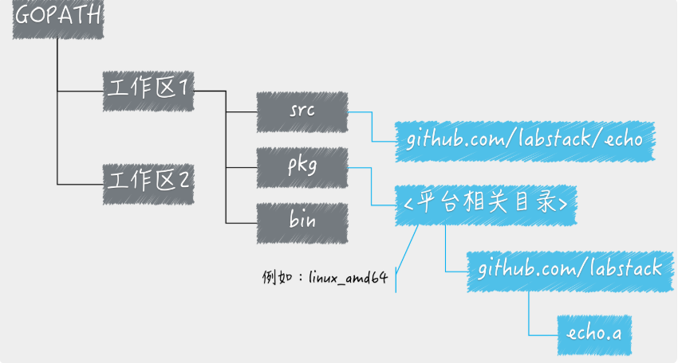
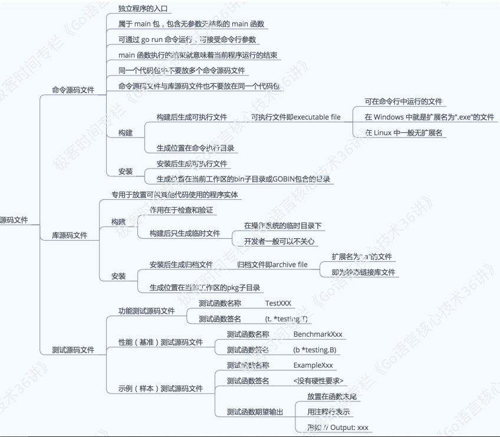

### 1.学习go准备工作

我们学习 Go 语言时，要做的第一件事，都是根据自己电脑的操作系统，从

[Go 语言官网下载安装包](https://golang.google.cn/).

安装完成后，使用命令行 执行 go version 打开安装目录，

GOROOT：Go 语言安装根目录的路径，也就是 GO 安装路径。

GOPATH：若干工作区目录的路径。是我们自己定义的工作空间

GOBIN：GO 程序生成的可执行文件的路径。

最重要的是GOPATH ,因为GO 项目在其声明周期里面的所有操作（编码，依赖管理，构建 ，测试，安装）都围绕着工作区和GOPATH进行。

### 2.go语言的源码组织方式

go语言的源码是以代码包为基本单位,需要注意的是 代码包的名称一般会和源码文件所在的目录同名。如果不同名，在构建和安装的过程中以代码包名称为准。导入代码包都会有导入路径。

```go
import "github.com/labstack/echo"
```

### 3.go语言构建，安装

### 
### 
```go
go install "路径"  // 路径 从gopath/src 后面开始
//命令源码文件：main包包含main方法的go文件
//库源码文件：存放供其他代码使用的程序实体
//install 命令源码文件的时候，会生成xxx.exe的执行文件在src/bin目录下
//install 库源码文件的时候，会生成 XXX.a的归档文件在src/pkg的目录下
```

```go
go build "路径" // 路径从gopath/src 后面开始
// build 命令源码文件的时候，会生成xxx.exe的执行文件当前目录下
//bulid 库源码文件的时候，不会生成任何文件，相当于编译检查。
// 可以添加 -x 参数 来看编译的过程中详细信息
```

```go
go get "路径" //主动去主流的代码仓库去拉取目标代码包，并且安装到GOPATH的第一个工作目录中。
//例如 go get golang.org/x/sync/semaphore
// -u  下载并安装
// -d 只下载不安装

```

```go
go run xxx.go //只能执行main包中包含main函数的文件。
//你会发现 go run xx.go的时候，速度会稍慢些，因为是先编译 go build再 执行的。直接执行 编译后的xx.exe文件就会快一些
```

详细的[命令行页面](https://golang.google.cn/cmd/go/)


