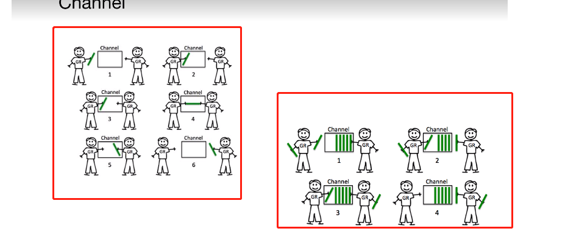

### 1.协程

thread vs goroutine

java创建线程的默认栈时1M，协程gotoutine的默认栈大小2k,

java线程之间切换，会涉及到内核对象的切换，消耗非常大，goroutine 多个协程对应一个内核对象。

### 2.go协程和go线程

一个go的线程上可以起多个协程，go的协程有独立的栈空间，共享程序的堆内存。可以理解为协程是轻量级的线程。

### 3. MPG模式

M:系统级别的线程

P:协程执行的上下文环境，协程处理器

G:goroutine go的协程


上图中有三个M,也就是系统级别的线程，如果这三个M都在一个cpu上，则是并发，如果在不同的cpu上。

则是并行。 可以看到每个p下面挂着一个协程的队列。go的协程是轻量级的，逻辑态的。

go1.8以后默认的是使用多核cpu。


上图是另一种mpg的运行状态，当g0协程阻塞的时候（比如文件io），这个时候会将等待的三个协程挂到m1的下面开始执行，m0线程下的g0仍然在执行，这样保证了既可以让g0执行，也可以不让队列中的其他协程阻塞。等到G0不再阻塞的时候，m0会被放到空闲的主线程中执行。

思考题：node的异步io是如何实现的呢？（用到了同样的数据结构 -- 队列）

```go
func TestGroutine(t *testing.T) {
	for i := 0; i < 10; i++ {
		go func(i int) {
			fmt.Println(i)
		}(i) //go 关键字表示启动一个协程。
	}
	time.Sleep(time.Millisecond * 50) //不加sleep的话，主线程退出的时候，协程也就退出了
}
```

### 4.channel

java中使用锁来进行并发机制的控制，go中也是支持锁的。sync.Mutex包中。

```go
func TestCounterThreadSafe(t *testing.T) {
	var mut sync.Mutex
	counter := 0
	for i := 0; i < 5000; i++ {
		go func() {
			defer func() {
				mut.Unlock() //更改完后释放锁
			}()
			mut.Lock() //每次更改变量的时候，需要加上锁
			counter++
		}()
	}
	time.Sleep(1 * time.Second)
	t.Logf("counter = %d", counter)

}
```

为什么使用 channel？

上面是通过锁来实现协程之间的通信的。有更好的方式来协调协程之间的通信，通过channel。

channel本质是一个队列，先入先出。channel是线程安全的。不需要加锁。


channel的两种通信机制


第一种：阻塞的方式   任何一方不在的时候，另一方都会等待，阻塞在那里。

第二种： 消息发送者和接收者更松耦合， buffer的channel

channel可以设置容量，容量不满的话 可以一直往里放。当容量满的时候才会阻塞。

当管道中有数据的时候可以一直取，当管道中没有数据的时候则会阻塞deadlock。

```go
var intChan chan int //channel 是指针类型，必须初始化才能写入数据，
intChan = make(chan int) //make 来初始化

var intChan1 chan int 
intChan1 = make(chan int，3)  //带有缓冲的通道

//往channel中放数据
intChan <-1

//从 channel中取数据
num := <- intChan

//注意：没有其他go协程的时候，取或者放 超过指定的容量会报错 deadlock 
```

channel的关闭和遍历

channel 关闭后，就不能往chnnel中写数据了，但是仍然可以从channel中读取数据

遍历的时候如果channel没有关闭，deaklock，channel关闭了，则能正常遍历数据。

```go
func dataProducer(ch chan int, wg *sync.WaitGroup) {
	go func() {
		for i := 0; i < 10; i++ {
			ch <- i
		}
		close(ch)

		wg.Done()
	}()

}

func dataReceiver(ch chan int, wg *sync.WaitGroup) {
	go func() {
		for {
			if data, ok := <-ch; ok {
				fmt.Println(data)
			} else {
				break
			}
		}
		wg.Done()
	}()

}

func TestCloseChannel(t *testing.T) {
	var wg sync.WaitGroup
	ch := make(chan int)
	wg.Add(1)
	dataProducer(ch, &wg)
	wg.Add(1)
	dataReceiver(ch, &wg)
	wg.Add(1)
	dataReceiver(ch, &wg)
	wg.Wait()
}
```


```go
// 第二种方式实现
func wirte(intChan chan int ){
	for i :=0 ; i< 100; i++{
		 intChan <- i
		 fmt.Println("write data",i)
	}
	close(intChan)
}

func read(intChan chan int ,exitChan chan bool){
	for {
		v,ok := <- intChan
		if !ok {
			break
		}
		fmt.Println("read data",v)
	}
	exitChan <- true
	close(exitChan)
}

func TestChannels(t *testing.T){
	intChan := make (chan int , 50)
	exitChan := make (chan bool , 1)
	go wirte(intChan)
	go read(intChan, exitChan)
	for{
		_,ok := <-exitChan
		if !ok {
			break
		}
	}
}
```


