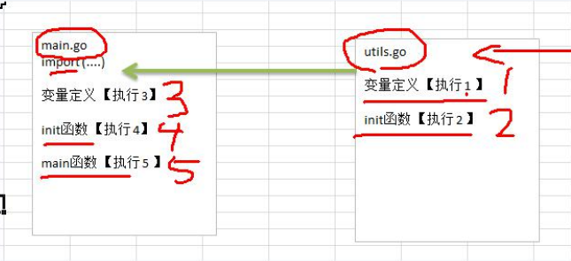

### 1.包的使用

1.import “包的路径”

```go
import "hello/utils" 
import(
    "fmt"    //引入包的时候 一般根据首字母排序，从gopath/后面的src下级算起
	"hello/utils"
)
```

2.文件夹名和包名一般一致，不一致的时候以文件夹名称为主。

3.为了能让其他包访问到本包的函数，函数名首字母大写。类似于java的public

4.访问其他包的函数的时候 包名.方法名

5.包名是可以起别名

```go
package _func

import (
	"fmt"
	"hello/utils"
	"testing"
)

func TestFunc(t *testing.T){
	i, i2 := utils.Cal(1, 2) //包名.函数名
	fmt.Printf("i = %d , i2 = %d" , i ,i2)
}
```

### 2.函数的使用

```go
//函数支持多返回值
func 函数名（形参列表）（返回值列表）{
    return 返回值列表
}
//多返回值
func Cal(n1 ,n2 int) (int ,int){
	fmt.Println(n1,n2)
	return n1,n2
}
//函数调用最需要注意的点 我踩过的坑，值copy 还是地址值的copy问题

func TestFunc2(t *testing.T){
	num := 20
	test02(num)
	fmt.Println("main num = ", num)
	test03(&num)//传递的是地址值
	fmt.Println("test03 num = ", num)
}

func test02(n1 int){ //传递过来的是值的copy
	n1 += 10
	fmt.Println("test02 num = ",n1)
}

func test03(n1 *int){ //传递过来的是地址值的copy 这比java灵活多了
	*n1 += 20 //通过指针操作变量
	fmt.Println("test03 num = ",*n1)
}
//地址copy的效率高，因为数据量小，值copy的话，数据越大，效率越低。结合场景去选择。

```

```go
//init 函数 一般做一些初始化操作
package main

import "fmt"

var age = test()

func test() int {
    fmt.Println("test")
    return 90
}
func init(){
	fmt.Println("init...")
}

func main(){
	fmt.Println("main")
}
//输出结果是 test init main  全局变量定义，init函数，main函数。

//问题 引入的包中也有init函数，执行的流程是怎么样？

```


```js
//js的闭包，猜一下执行的结果
var fun = function(){
  var count = 0;
  return function(){
    return count +=1;
  }
}
var fn = fun();
console.log(fn());
console.log(fn());

```
```go
//golang的闭包
func AddUpper() func(int)int{
	var n int = 10

	return func(x int) int{
		n = n+ x
		return n
	}
}

func TestAddUpper(t *testing.T){
	f := AddUpper()
	fmt.Println(f(1)) //需要注意的是反复调用的时候，变量n只会初始化一次。
	fmt.Println(f(2))
	fmt.Println(f(3))
}
```

```go
//defer 函数的使用 一般在函数执行完毕的时候，及时释放资源。

func sum(n1  ,n2 int) int {
    // 执行defer的时候，会将defer压入到独立的栈（defer栈）。
    //当函数执行完的时候，再从defer栈，按照先入后出的方式执行。
	defer fmt.Println("ok1 = ",n1)
	defer fmt.Println("ok2 = ", n2)

	n1 ++
	n2 ++
	res := n1 +n2
	return res
}

func TestDefer(t *testing.T){
	res := sum(10,20)
	fmt.Println("ok3 res = ",res)
}
//执行结果是？

```

### 3.错误处理

```go
//go 语言追求简单优雅，不支持传统的try-catch-finally
//处理方式为 defer panic recover

func test(){
	defer func(){
		err := recover()
		if err != nil{
			fmt.Println("err = ", err)
		}
	}()
	num := 10
	num2 := 0
	res := num/num2
	fmt.Println("res = ", res)
}

func TestError(t *testing.T){
	test()
}

//自定义错误
errors.New("错误说明")


```

