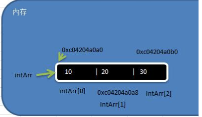
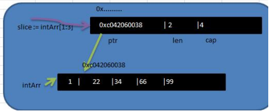
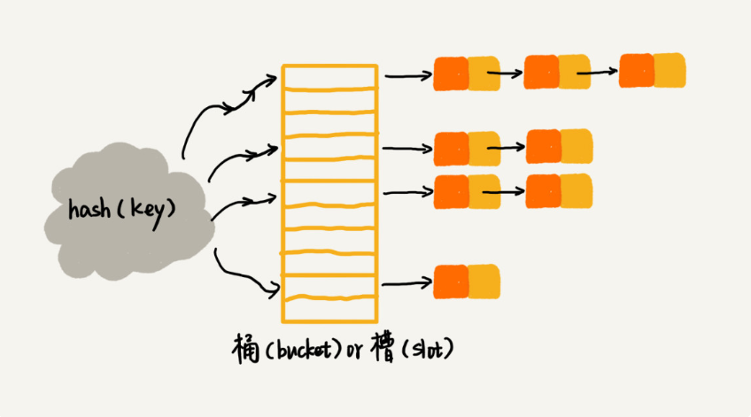

### 数组和切片，map

问题：什么是数组？有什么特点？数组的下标为什么从0开始？


```go
//数组的定义
    var a [3]int
	a[0] = 10
	a[1] = 20
	a[2] = 30
	fmt.Println(a)
	fmt.Printf("a的地址= %p a[0]的地址= %p a[1]的地址 = %p" , &a ,&a[0] ,&a[1])
//数组中的地址是可以通过&来获取，数组中第一个元素的地址就是数组的地址。
//golang中数组的长度是类型的一部分， [2]int [3]int 不是同一种数据类型
```

数组是存储同一种数据类型的连续的内存空间的数据结构。

因为数组这种存储方式，所以根据下标查询，时间复杂度o(1)，查询效率高。但是插入的时候，需要挪动元素，时间复杂度o(n),插入删除效率低。下图是数组的内存布局：



```go
//数组中一般初始化数组的方式
    var numArr01 [3]int = [3]int{1,2,3}
	var numArr02 = [3]int{1,2,3}
	var numArr03 = [...]int{1,2,3}
	numArr4 := [...]string{"tom","jack","marry"}
	//遍历数组
	for i,v := range numArr4{
		fmt.Printf("i = %v v = %v\n" , i,v)
	}
//注意点 数组是值类型，传递的时候是值copy，因此数组间是不会受到影响的

```

```go
//切片是动态的数组,切片是引用类型
var a []int // []中没数字则是切片
var intAddr [5]int = [...]int{1,22,33,66,99}
slice := intAddr[1:3]
fmt.Println("slice len = ", len(slice)) //2
fmt.Println("slice cap = ", cap(slice)) //4
//数组的容量和长度是相同的，切片的则不是 。
```

下图是切片的内存布局


从内存布局分析 切片的结构是 存放了数组的指针，切片的长度，切片的容量，

切片中有几个元素就是多长。容量则是从切割底层数组的起使位置到数组末尾的长度。

```go
//make方式创建切片是比较常用的方式
var  slice []int = make ([]int , 5,10)
slice[1] = 10
slice[2] = 20
//make创建切片的时候底层也会维护一个数组，知识对于我们来说是不可见的。该数组[10,20,0,0,0]

//使用append对切片进行扩容
var slice1 []int = []int{11,22,33}
slice1 = append(slice1, 44)
//当一个切片中无法容纳更多的数据的时候，就会自动扩容。
```

### 字典的操作规范

```go
//字典类似于java的map
//创建方式1
var s  map[string]string //声明map类型的变量。
s = make(map[string]string, 10) 
s["hello"] = "world"
...
//创建方式2
b := make(map[string]string)
b["hello"] = "world"
//创建方式3
c = map[string]string{
    "hello":"world",
    "nihao":"world",
}

//如何判断键值是否存在？
aMap := map[string]int{
	"one":    1,
	"two":    2,
	"three": 3,
}
k := "two"
v, ok := aMap[k]
if ok {
	fmt.Printf("The element of key %q: %d\n", k, v)
} else {
	fmt.Println("Not found!")
}
//map在初始化的时候会有默认值的，所以无法通过key是否有值来判断。只能通过上面的方式

```

扩展：字典的key类型一般都选取什么类型？

字典的底层数据结构是hash表，数组加链表的方式，在往hash表中存放数据的时候，会hash（key）来找到数组的下标，判断当前数组是否存放有元素，如果有的话，则往链表上追加。追加的时候会比较key是否相同，因此，key的选取需要满足两个条件，一定是支持判等（函数，接口，切片等不支持判等）。一个是hash（key）运算的时候尽量速度要快。因此选取长度较短的比较合适。




### 流程控制语句

```go
//if 条件表达式不要有小括号,表达式可以用来声明变量

	name := 15

	if age := 20 ;name != 15{
		fmt.Println(age)
	}else{
		fmt.Print(age)
	}

//switch 
	var key byte = 'w'

	switch key {
	case 'a': //case后面是可以跟表达式的 
		fmt.Println("周一")
	case 'b':
		fmt.Println("周二")
	default :
		fmt.Println("错误")
	}
//for 循环的语法 需要注意 没有小括号
for i := 0; i< 10; i++{
    fmt.Println(i)
} 
//go中没有while 循环，无限循环 for{}


```

