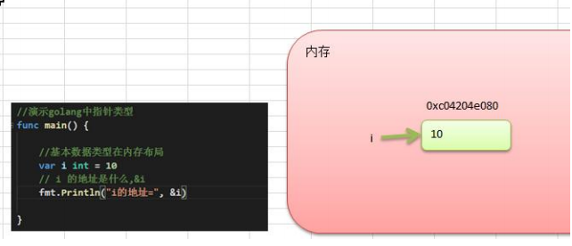
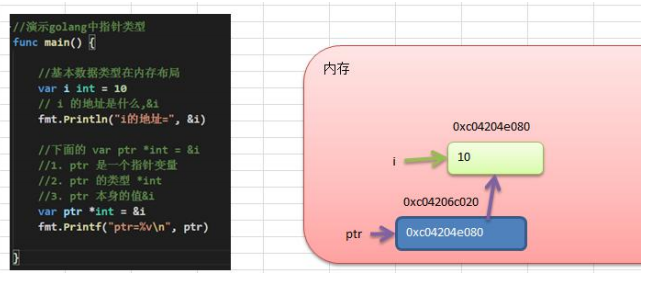

### 程序实体

注： 程序实体包含变量，常量，函数，结构体，接口

#### 1.变量声明的方式：

```go
var name string  //定义并没有赋值，则默认赋初始值
var name = "hello" //类型推导是编程语言在编译期自动解释表达式类型
name := "string" //短变量声明（只能使用在函数或者更小的代码块中）
//go 是静态类型语言的，但是用了动态类型语言优点，类型的确定是编译期完成的，不会影响程序的运行效率。
```

```go
package bianLiang

import (
	"testing"
)

func TestVar(t *testing.T){
	var name = getTheFlag() //name自动类型推导
	t.Log(name)
}


func getTheFlag() string {
	return "hello world" //随意更改 返回的结果值
}
```

### 2.变量的重声明

```go
var err error
n, err := io.WriteString(os.Stdout, "Hello, everyone!\n")
//err 被声明了一次， n,err := 的时候又被声明了一次 
//需要注意 重声明的时候，必须有其他变量一同被声明，比如 n
```

### 3. 常量

```go
const x ,  y int = 123 , ox22 //一次定义多个常量，变量也是可以 
```

#### 4.变量的基本数据类型

```go
//基本数据类型 
//注意：golang中没有专门的字符类型，如果要存储单个字符，一般使用byte
var c1 byte = 'a'
var c2 byte = '0'
fmt.Println("c1 = ", c1) //直接输出byte值。
fmt.Println("c1 = ", c1) 
fmt.Printf("c1 = %c ,c2 = %c \n" ,c1 ,c2)

//基本数据类型之间的相互转换 go不能自动转换
var i int32 = 100
var n1 int64 = int64(i)
var n2 int8 = int8 (i)
fmt.Printf("i = %v n1 = %v n2 = %v", i, n1,n2)

//string 和基本数据类型之间的转换
var num1 int = 99
str := fmt.Sprintf("%d" , num1)
fmt.Printf("str = %T",str)

var str2 string = "12345"
n,_ := strconv.ParseInt(str2,10,64)
fmt.Printf("str = %T", n)

```

#### 5.变量引用类型

```js
//先来个js的题
var num =2
function test(n){
    n =3
}
test(num)
console.log(num) //输出结果是？

var obj = {name : 'zhangch'}
------------------------------
function test1(n){
    n.name = 'lisi'
}
test1(obj)
console.log( obj) //输出结果是？

var obj = {name : 'zhangch'}
-----------------------------
function test2(n){
    n = new Object();
    n.name = 'liuzz'
}
test2(obj)
console.log( obj) //输出结果是？

```

基本数据类型变量存放的值，叫做值类型。

使用& 来获取变量的地址


指针类型，指针变量存放的是一个地址，这个地址指向的空间才是值

```go
var i int  = 10

fmt.Println("i的地址=", &i)

var ptr *int = &i

fmt.Printf("ptr = % v \n" , ptr)

```
值类型都有对应的指针类型，*数据类型 int 对应的指针*  *int 

值类型包括：基本数据类型 int,float, 数组，结构体struct

总结：值类型直接存储值，内存在栈分配，引用类型存储地址，内存在堆上分配。当没有任何变量引用这个地址的时候，对应数据变成垃圾，由GC来回收。


