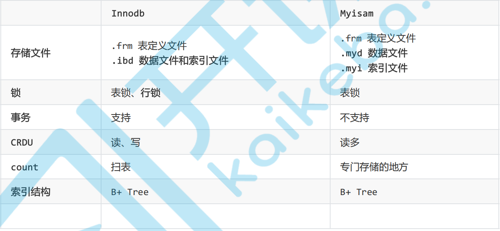
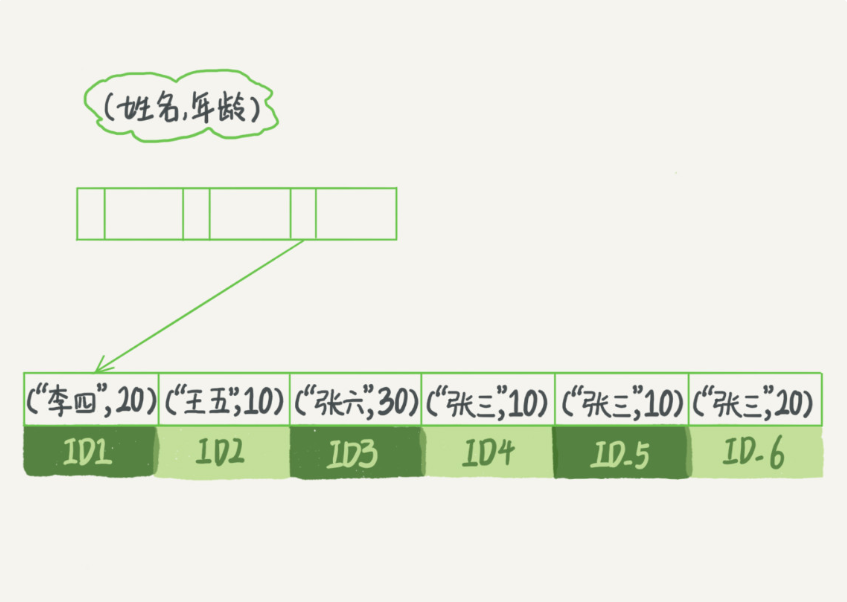

上图是Innodb和myisam之间的区别

### Btree 和 B+ tree的区别

```java
B 树 是叶子节点和非叶子节点都会存储数据
B + 树，只有叶子节点存储数据，而且叶子节点是通过指针的方式串起来的。也就是顺序表。
问题： 链表是单向的还是双向的？ 肯定是双向的 因为做查询的时候  》= 或者  《= 表示的是两个方向

梳理流程：
hash表只支持等值的查询 o(1),不支持区间查询。跳表的时间复杂度o(n).
B+tree是从平衡二叉查找树进化来的。因为索引的数据结构存储在硬盘上。需要io到磁盘上。每层都需要一次io，索引尽量减少层级。多叉查找树。

/**
 * 这是 B+ 树非叶子节点的定义。
 *
 * 假设 keywords=[3, 5, 8, 10]
 * 4 个键值将数据分为 5 个区间：(-INF,3), [3,5), [5,8), [8,10), [10,INF)
 * 5 个区间分别对应：children[0]...children[4]
 *
 * m 值是事先计算得到的，计算的依据是让所有信息的大小正好等于页的大小：
 * PAGE_SIZE = (m-1)*4[keywordss 大小]+m*8[children 大小]
 */
public class BPlusTreeNode {
  public static int m = 5; // 5 叉树
  public int[] keywords = new int[m-1]; // 键值，用来划分数据区间
  public BPlusTreeNode[] children = new BPlusTreeNode[m];// 保存子节点指针
}

/**
 * 这是 B+ 树中叶子节点的定义。
 *
 * B+ 树中的叶子节点跟内部结点是不一样的,
 * 叶子节点存储的是值，而非区间。
 * 这个定义里，每个叶子节点存储 3 个数据行的键值及地址信息。
 *
 * k 值是事先计算得到的，计算的依据是让所有信息的大小正好等于页的大小：
 * PAGE_SIZE = k*4[keyw.. 大小]+k*8[dataAd.. 大小]+8[prev 大小]+8[next 大小]
 */
public class BPlusTreeLeafNode {
  public static int k = 3;
  public int[] keywords = new int[k]; // 数据的键值
  public long[] dataAddress = new long[k]; // 数据地址

  public BPlusTreeLeafNode prev; // 这个结点在链表中的前驱结点
  public BPlusTreeLeafNode next; // 这个结点在链表中的后继结点
}

```

### 密集索引和稀疏索引

```java
//密集索引（innodb）
完整的记录，存储在主键索引中，通过主键索引，可以获取索引所有的列。表数据和索引是在一起的。
如果没有主键，mysql会自动选择一个唯一值得列作为主键。这种列都没有得话。innodb会自动生成一个隐藏列
//辅助索引
存储得都是主键索引得主键值，不是地址值。非主键的查询，需要两次搜素索引树。最终获取数据

//非聚集索引（myisam）
B+tree的叶子节点存储数据行的指针，也就是数据和索引不在一起。

```

### 索引覆盖和最左前缀原则

```java
//select id from 表 where id = 1
当根据某个字段查询的时候，不需要回表则是覆盖索引。select * from 因为 * 的时候查询所有字段 需要回表
//最左前缀 
为什么 a,b 的联合索引  根据a 查询的时候 索引不失效，b查询的时候索引失效
根据索引的存放图来说明问题。还是根据叶子节点链表的顺序性。
//思考题 a b c d 的联合索引 。a =1 ， b = 2 and c >3 and d = 4 这几个字段都用到了索引吗？
c >3 可以使用索引 但是 d 则无法使用索引了
也就是遇到范围查询的时候会停止匹配了

```



